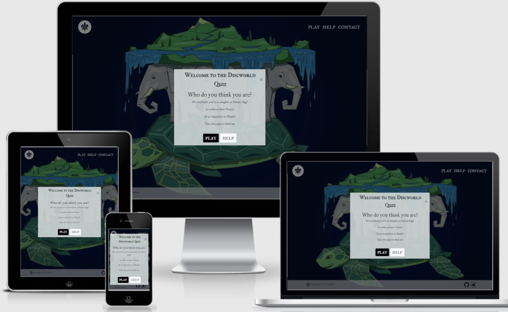
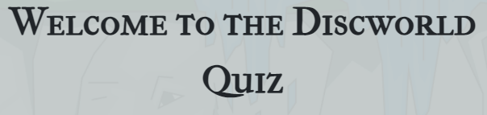
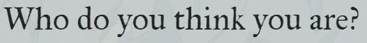
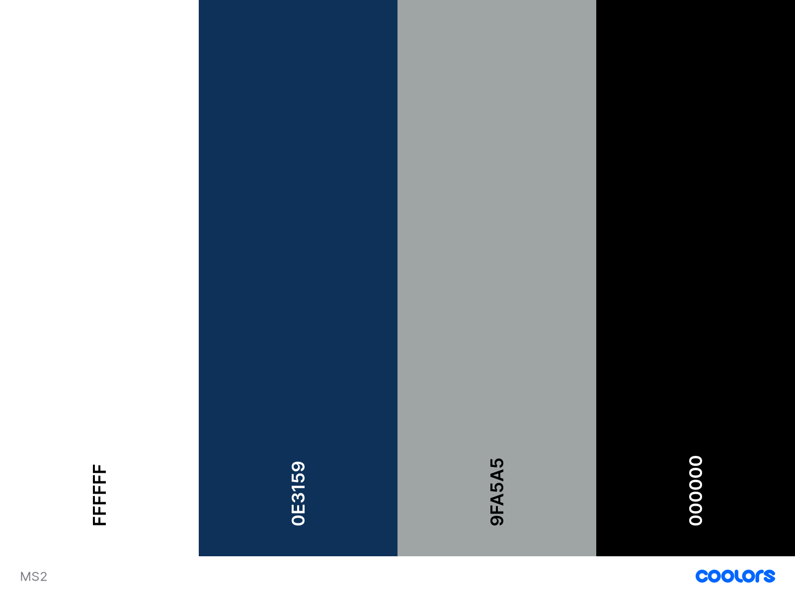

# Terry Pratchett Discworld Quiz!

## About

**Terry Pratchett Discworld Quiz** is an entertainment site for fans (new and old) of the Discworld books and films by Terry Pratchett to play and discover which character they identify as and also for people to share with friends who are not familiar with the books yet. 

I designed the site with the Discworld theme in mind and using the colour schemes from the hero image on index.html to maintain the theme over all pages. It is designed to be responsive and accessible on a range of devices, making it easy to navigate for all users, although primarily on mobile.

The goal of the website will be to interact with fans of the Discworld and people new to the genre and be a source of information to educate them through sharing information about the characters and the books they appear in. The site also encourages feed back from users via the contact.html page.

The site must contain all information required to complete these goals and site visitors will most likely have done these types of quizzes before so must stand out.

Link to [live site](https://suzybee1987.github.io/milestone-2/index.html)

## **Contents**

- [**UX (User Experience)**](#ux-user-experience)
  - [**User Stories**](#user-stories)
  - [**Site Owner Goals**](#site-owner-goals)
- [**Design Choices**](#design-choices)
  - [**Fonts**](#fonts)
  - [**Colours**](#colours)
  - [**Imagery**](#imagery)
  - [**Wireframes**](#wireframes)
- [**Technologies**](#technologies)
  - [**Languages**](#languages)
  - [**Libraries**](#libraries)
  - [**Tools**](#tools)
- [**Features**](#features)
  - [**Features Implemented**](#features-implemented)
  - [**Future Features**](#future-features)
  - [**Responsive Design**](#responsive-design)
- [**Version Control**](#version-control)
- [**Testing**](#testing)
- [**Deployment**](#deployment)
  - [**Running Locally**](#running-locally)
- [**Credits**](#credits)
  - [**Code**](#code)
  - [**Content**](#content)
  - [**Images**](#images)
  - [**Videos**](#videos)
  - [**Inspiration**](#inspiration)
  - [**Acknowledgements**](#acknowledgements)
  

## **UX (User Experience)**

### **User Stories**
- As a Terry Pratchett fan 
    - I want to play the game to find out which character I am most like and to see a picture of them with a brief description
    - I want to be able to share on social media to share with friends and other Discworld lovers  
    - I want to see a link to the Discworld site
    - I want the site to have images from the books showing the different characters on the main screen
    - I want to see quotes from my favourite books in the series as part of the questions
    - I want the quiz to follow the Discworld theme of colours

- As a user returning to the site:
    - I want to be able to do the quiz multiple times to get different answers and see the descriptions of different characters and which books they appear in

- As a user who does not know the Terry Pratchett Discworld series
    - I want an explanation of each character when I complete the quiz
    - I want to see a picture representing the character to give me an idea of their personality
    - I want to see a help section to get information on how to play the game

- All users
    - I want the site to be easy to navigate on mobile primarily so I can complete it on the go and this also makes it easier to share with others
    - I want the ability to turn on and off noises 
    - I want the quiz to be slick and the questions and answers to appear in turn rather than a long list

### **Site Owner Goals** 
- As a site owner I want to educate users on the Discworld series to encourage them to read the books
- As a site owner I want the site to be easy to navigate so that people will return and also share with friends

[Back to contents](#contents)

## **Design Choices**

### **Fonts**

I have chosen [IM Fell French Canon SC](https://fonts.google.com/specimen/IM+Fell+French+Canon+SC) for the headers as it is easy to read and has sufficient contrast to the main body font. The small caps style is used by the character Death in the series and as he is a prominent character I have used it for readers of the series to enjoy. 

and [IM Fell Great Primer](https://fonts.google.com/specimen/IM+Fell+Great+Primer) for the rest of the text on the site as it is easy to read with wider spacing than other fonts and complements the header font so well. It uses the same style as IM Fell French Canon SC but uses lower case so the user does not have to read a wall off caps text.

### **Colours**

As the site follows the Discworld theme I have used colours from the hero image on index.html throughout the other pages to maintain consistency. And as one of the subthemes of the books surrounds the Night's Watch I used a dark sky hero image for the game.html page. 
It features complementary dark blues, greens, silvers and white to create a good contrast and improve readability. 

The colours chosen are:

Format: [Coolors Palette](https://coolors.co/ffffff-0e3159-9fa5a5-000000)

These colours complement each other well, in keeping with what the user expects. 

### **Imagery**

The hero image on index.html is a picture of the Discworld as this is the theme of the quiz, it features the world resting on the back of four elephants being carried through space on a turtle (Great A'Tuin). This was sourced from [Shutterstock](https://www.shutterstock.com/editor/image/diskworld-resting-on-elephants-big-turtle-1151824745)

The hero image from the game.html page is a night sky sourced from [Shutterstock](https://www.shutterstock.com/image-vector/night-shining-starry-sky-blue-space-1081014557) and complements the colour scheme.

### **Wireframes**

The wireframes were created using [Adobe XD](https://www.adobe.com/uk/products/xd.html) and can be found in pdf form in [wireframes](assets/readme_docs/wireframes)

- Desktop view
    - [Home](assets/readme_docs/wireframes/home_wide.png)
    - [How To](assets/readme_docs/wireframes/how_to_wide.png)
    - [Contact Page](assets/readme_docs/wireframes/contact_wide.png)
    - [Game Play](assets/readme_docs/wireframes/play_wide.png)
    - [Results](assets/readme_docs/wireframes/end_wide.png)

- Mobile view
    - [Home](assets/readme_docs/wireframes/home_pixel.png)
    - [How to](assets/readme_docs/wireframes/how_to_pixel.png)
    - [Contact Page](assets/readme_docs/wireframes/contact_pixel.png)
    - [Game Play](assets/readme_docs/wireframes/play_pixel.png)
    - [Results](assets/readme_docs/wireframes/end_pixel.png)

[Back to contents](#contents)

## **Technologies**

### **Languages**

- [HTML5](https://developer.mozilla.org/en-US/docs/Web/HTML)
  - Used as the main markup language for the website content.
- [CSS3](https://developer.mozilla.org/en-US/docs/Web/CSS)
  - Used to style the individual webpages.
- [JavaScript](https://developer.mozilla.org/en-US/docs/Web/JavaScript)
    - Used to show the questions through pagination and for the game play.

### **Libraries**

- [Bootstrap 5](https://getbootstrap.com/docs/5.0/getting-started/introduction/)
    - Used to design a mobile-first responsive website layout along with custom components (navbar, modal and form). 
- [jQuery](https://developer.mozilla.org/en-US/docs/Glossary/jQuery) 
    - Used as click event listeners when each answer clicked to generate next question and also play a sound. Also used Bootstrap collapse for navbar on mobile and tablet view

### **Services**

- [emailJS](https://www.emailjs.com/) 
    - Used with the contact form to receive the comments from users
  
### **Tools**

- [Git](https://git-scm.com/)
  - Git was used for version control (commit to Git and push to GitHub).
- [GitHub](https://github.com/)
  - Used to store, host and deploy the project files and source code after being pushed from Git. I also used it for the Project Kanban board to keep track and split tasks into smaller tasks to make them easier to fulfill.
- [Gitpod](https://www.gitpod.io/)
  - An online IDE linked to the GitHub repository used to write my code.
- [Neon Project](https://thenounproject.com/)
  - For the images of the characters and spinning turtle home button
- [Google fonts](https://fonts.google.com/)
  - Used to compare and choose fonts. 
- [Coolors](https://coolors.co/)
  - Used to research and choose the colour scheme by comparing and contrasting similar colours in the generator.
- [Favicons](https://favicon.io/)
  - Used to generate a favicon for the website title.
- [Lighthouse](https://developers.google.com/web/tools/lighthouse)
  - Used to audit the site for quality and ensure responsiveness.
- [WebPageTest](https://www.webpagetest.org/)
  - Used to test performance.
- [amiresponsive](http://ami.responsivedesign.is/)
  - An online tool to check how responsive the site is on different devices.
- [tinypng](https://tinypng.com/)
  - Used to reduce the size of the images for better user experience.
- [JSHint](https://jshint.com/)
    - Used to detect errors in the JavaScript files

[Back to contents](#contents)

## **Features**

### **Features Implemented**

Features relevant to all pages:

- **Header**
    - Contains the navigation links and is fixed to the top of the page for easy use on all devices (this was done using Bootstrap fixed top class).
    - All links show an underline or animation when hovered over (except volume button on game.html to prevent confusion) and for the icons this is done using the border attribute to provide spacing and prevent overlapping the icon. The animation for the home button is a turtle that spins which relates to the turtle from the book series.
    - The home button is on the left side of the header and sections of the page listed on the right where a user would expect them to be.
    - Navigation links are underlined or animated when the user hovers over them to give feedback that they have hovered over the right spot.
    - The navbar is transparent to alow the user to enjoy the full length of the hero images.
    - On mobile view the navigation links collapse in to a toggle button for easier user experience. As the navbar list font is hard to see against the background I have added a background to the links. Some JavaScript was used with the navbar to ensure the menu closes after a link is pressed to avoid the user having to close the menu afterwards. 
    - The colour scheme is designed to be easy to read with the contrast and the ratio tested on Google Dev Tools.

- **Hero sections**
    - The images take up the full width of the browser to leave a high impact lasting impression with the user and this is replicated on all pages to bring a sense of familiarity when browsing.
    - On index.html the modal launches to prompt the user to play or check the help information to learn how the quiz works. 
    - On game.html the hero image takes up the whole viewport and below as the results page has more text on it - this is to prevent whitespace. As previously mentioned the navbar is transparent to allow the user to see the full image and is consistent in design.
  
- **Footer** 
    - Transparent and fixed at the bottom of the screen. It wouldn't sit after all of the content since this would create white space which is a bad user experience.  
    - Contains a link to my GitHub repository and also Instagram to encourage the user to share the site with others and search for Discworld related pages. It also reminds the user the content is copyrighted by Terry Pratchett. 

  
#### *index.html*
  
- **Modal**
   - The modal launches on page load and prompts the user to click to play the game or be directed to the help modal. The help modal instructs the user to how the quiz works and has a link to game.html for ease once the user has learned the help information. 

#### *game.html*

- **Questions and Answers section**
    - The quiz section is loaded to game.html via pagination from the script.js file. The questions are loaded in quiz.json and then accessed by script.js to display on game.html. The questions are aligned at the top and then the four answers in Bootstrap buttons which scale slightly upwards in size when clicked. 

- **Mute button**
    - On desktop the mute button is situated at the top right of the page and is automatically set to mute for the best user experience. On the mobile page this is located in the middle of the navbar to ensure the users eye is drawn to it when they play the game. The noise is a 'whoosh' and makes it feel like the answers are being quickly pulled off the page to reveal the next question. 

- **Results**
    - The results section is revealed once all of the questions have been asked and shows an icon of the character chosen, a description of that character and a list of the books they appear in. These are also linked to the page via pagination from the script.js file and allow the user to get more information about the character chosen. This section also has a 'Try Again' button to encourage the user to try and get different characters. By clicking this link the game.html is reloaded from the start. 
    - I have extended the viewport height of the hero image on this page because the results list can be long depending on character picked and this avoided any whitespace. 

#### *contact.html*

- **Contact form**
    - For the user to give feedback these fields are required: Name, Email and comments and show error messages if not filled before clicking submit. Once the user fills out this section an email is sent to my inbox with the details and the user receives confirmation via JavaScript alert to confirm their email has been sent. 
    - On the form the buttons are as a user would expect there is a submit and reset button on the form with the Reset button having more muted colours and Submit button the obvious choice for the user to select upon filling out the form.  

- **Modal**
    - This component from Bootstrap's library is used to launch the help modal again in case the user is still in need of this information and then linked to game.html from here. 

#### *404.html*

 - **Button**
    - On the 404.html page the button redirects the user back to index.html to prevent them having to press the browser back button. 

### **Future Features**
- I would like to implement a link to share with friends on WhatsApp and social media 
- I would like to use local storage to save the mute status on the game

### **Responsive Design**

- Bootstrap columns were used to make the site responsive on all devices and viewport height adjusted for best user experience

[Back to contents](#contents)

## **Version Control**

**Version control** was managed within **GitHub** and **Gitpod** and regular commits pushed to **GitHub**. 
See below for how this was managed:

### Gitpod Workspaces
1. Starting from GitHub clone the [Code Institute template](https://github.com/Code-Institute-Org/gitpod-full-template) by clicking Use This Template and copying to my repository under the name ms1-ali-shiatsu. The workspace is then launched by clicking GitPod - this action only needs to be performed once and then workspace reopened from GitPod.
2. Start the Gitpod Workspace which opens an **online IDE editor** window.

### Gitpod branching and committing to GitHub
1. I created various branches to work on different sections of code to push to master. I did this by typing into the terminal the commands: *git status* to find out which branch currently on; *git switch -c <*branchname*>* to create a new branch and switch to it immediately and then once the work was completed on that branch typed *git add <*files to be added*>* , *git commit -m <*commit message*>* and *git push --set-upstream <*remote*> <*branchname*>* to push to GitHub. I then created a pull request to pull the changes to the master if happy with the changes. From this point I would use *git -d <*branchname*>* to delete the local branch and delete the remote branch on GitHub. 
2. Meaningful commit messages were used to allow to roll back any changes made throughout the journey.

[Back to contents](#contents)

## **Testing**

- Testing can be found [here](TESTING.md)

## **Deployment**

The project was developed using [GitPod](https://gitpod.io/) and pushed to [GitHub](https://github.com/) as follows:

To deploy the page to **GitHub Pages** these steps were taken:
1. Log in to **GitHub**.
2. Select **suzybee1987/milestone-2**.
3. Click Settings and scroll down to **Pages**.
4. Under **Source** select **None** and then **Master Branch**.
5. The site automatically refreshes and the website deployed providing the link: https://suzybee1987.github.io/milestone-2/index.html

### How to contribute to the site

1. Navigate to [GitHub](https://github.com/) and log in
2. Locate my [repo](https://github.com/suzybee1987/milestone-2)
3. On the right side of the screen click Fork
4. This creates a copy in your own repository to make changes in [GitPod](https://gitpod.io/)
5. Once finished with changes add, commit and push to your own [GitHub](https://github.com/)
6. Click Pull Requests and select "New Pull Request" button.

### How to run the project locally

To clone this project from GitHub follow the instructions taken from [GitHub Docs](https://docs.github.com/en/github/creating-cloning-and-archiving-repositories/cloning-a-repository):
1. Navigate to the [GitHub Repository](https://github.com/suzybee1987/milestone-2)
2. Above the files click the green Download Code link.
3. To clone using HTTPS click the clipboard symbol under "Clone with HTTPS". To clone using SSH key click Use SSH then click the clipboard symbol. To clone using GitHub CLI select Use GitHub CLI and click the clipboard symbol. 
4. Open Git Bash
5. Change the working directory to the location you want the cloned directory to be.
6. Type 'git clone' and paste the url copied from step 3. 
7. Press 'enter' to create your clone.

[Back to contents](#contents)

## **Credits**

### **Code**

- CodeInstitute Full Stack Developer Course
- [SitePoint](https://www.sitepoint.com/simple-javascript-quiz/#whatsnext) for help with the quiz layout including pagination
- Wes Bos [JavaScript 30](https://javascript30.com/) for extra ideas on using JavaScript
- [Hackathon](https://github.com/NicolaLampis/hackathon_ci) I took part in at the beginning of the year where I got some ideas of loading the json before beginning the quiz.
- Some help from Sean Young and Scott Boning on Slack [post](https://code-institute-room.slack.com/archives/C7HD37Q1F/p1626514069349200) to map the answers chosen

### **Content**

- The content was taken from Terry Pratchett's Discworld [novels](https://www.terrypratchettbooks.com/books/) and questions and answers created by myself with some inspiration from [this site](https://www.allthetests.com/personality-tests/are-you-this-star-figure/book-characters/other-book-characters/quiz05/1050277506/which-discworld-character-are-you)
- Descriptions of the characters were loosely taken from [Discworld Fandom](https://discworld.fandom.com/wiki/Main_Page)
- The README.md content carried over from MS1 README.md and feedback from assessor.

### **Layout**

-Code Institute lessons using bootstrap
-[Background layout](https://css-tricks.com/perfect-full-page-background-image/) from css-tricks.com

-[Layout fix](https://css-tricks.com/fixed-headers-on-page-links-and-overlapping-content-oh-my/) when contact form overlapped footer

-[Modal on submission](https://github.com/natalie-kate/haunted) issue was coming up because the button type="button" was required to make the modal work but this button type doesn't produce error if required fields not completed. Checked on slack and found a solution from post on #peer-code-review where @Nat_kate managed to fix this issue.

### **Images**

- The hero images were sourced from Shutterstock see [here (index.html)](https://www.shutterstock.com/editor/image/diskworld-resting-on-elephants-big-turtle-1151824745) and [here (game.html)](https://www.shutterstock.com/image-vector/night-shining-starry-sky-blue-space-1081014557)
I downloaded these via a standard licence trial. 
- The results icons were taken from [Noun Project](https://thenounproject.com/) and [GitHub](https://github.com/logos).

### **Audio**

- The audio for the 'whoosh' sound on game.html was sourced from [Freesound.org](https://freesound.org/people/qubodup/sounds/60013/) and is available for public use for free.

### **Inspiration**
 
- [Abibubble's Harry Potter Quiz](https://github.com/Abibubble/milestone2-harry-potter-quiz) gave me the idea of creating a quiz with pagination. 
- [My Wizarding World ](https://my.wizardingworld.com/login) inspired my choice of background on game.html

### **Acknowledgements**

- My Mentor for confidence boosting and helpful advice and feedback.
- Friends and family for testing the site and giving feedback on different devices.
- @Tobi and @Scott_Boning_lead on Slack who supported me through the journey.
- My husband for all his support, patience and great ideas.

[Back to contents](#contents)